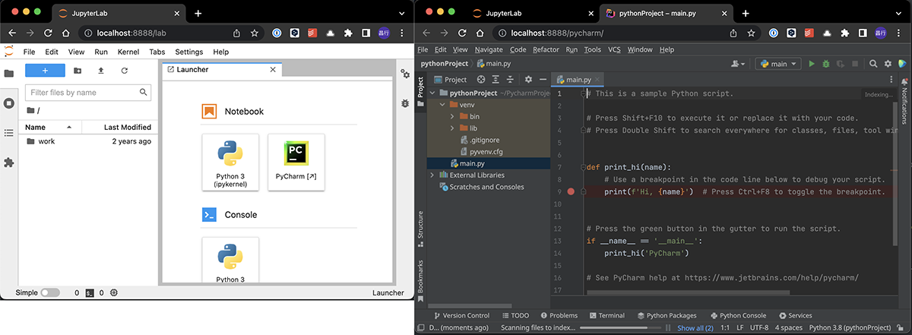

This project outlines how to create a Docker container that encapsulates Pycharm (This example uses the `Community` version.).

https://pypi.org/project/jupyter-projector-proxy/

## usage

### 1. build docker image

`build.sh` contains instructions for building a Docker Image (Dockerfile.base) that installs pycharm and a Docker Image derived from that Docker Image (Dockerfile.cpu) or a Docker Image running on a GPU ( Dockerfile.gpu) that runs on a GPU.

```bash
bash build.sh
```

### 2. run docker container

`docker-compose.yaml` contains the basics.

```bash
docker-compose up
```

### 3. open browser

```
http://localhost:8888
```

## IDE Restart

If the projector stops due to some error, use the following command.

##### in container command line

```bash
~/.local/bin/projector run
```

##### host (docker-compose)

```bash
docker-compose exec pycharm /home/jovyan/.local/bin/projector run
```

### IDE Settings

```bash
~/.local/bin/projector config list
~/.local/bin/projector config show
```

## Edit

### Other Jetbrains Product

> jupyter-projector-proxy
> https://pypi.org/project/jupyter-projector-proxy/
> See `Generic installation example:`

edit `Dockerfile.base`

```Dockerfile
...
RUN apt-get update && apt-get install -y --no-install-recommends \
    build-essential \
    ...
    mkdir -p /opt/pycharm && \
    curl -L "https://download.jetbrains.com/product?code=PCC&latest&distribution=linux" \
    | tar -C /opt/pycharm --strip-components 1 -xzvf - && \
    chown jovyan /opt/pycharm/bin/idea.properties && \
    ln -s /opt/pycharm/bin/pycharm.sh /usr/bin/pycharm && \
    ...
```

to `IntelliJ IDEA Ultimate`

```Dockerfile
RUN apt-get update && apt-get install -y --no-install-recommends \
    build-essential \
    ...
    mkdir -p /opt/idea && \
    curl -L "https://download.jetbrains.com/product?code=IU&latest&distribution=linux" \
    | tar -C /opt/idea --strip-components 1 -xzvf - && \
    chown jovyan /opt/idea/bin/idea.properties && \
    ln -s /opt/idea/bin/idea.sh /usr/bin/intellij-idea-ultimate && \
    ...
```

## extra

### Plugins

> marketplace
> https://plugins.jetbrains.com/

> https://pleiades.io/help/pycharm/2022.3/directories-used-by-the-ide-to-store-settings-caches-plugins-and-logs.html

##### Mac (jetbrains tool box)

- /Users/${USER}/Library/Application Support/JetBrains/Toolbox/apps/PyCharm-P/ch-0/222.4459.20/PyCharm.app.plugins

##### Linux

- /home/jovyan/.projector/configs/pycharm/plugins
- /home/jovyan/.projector/configs/pycharm/system/plugins
